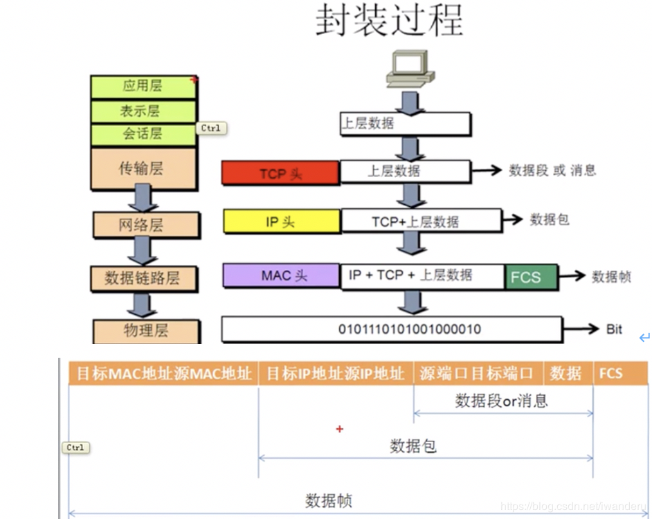
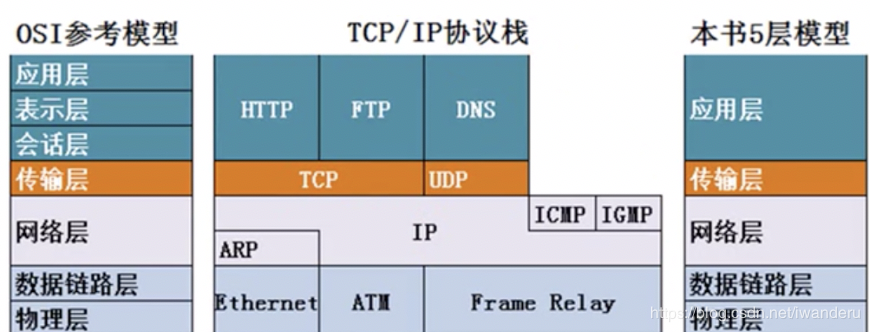
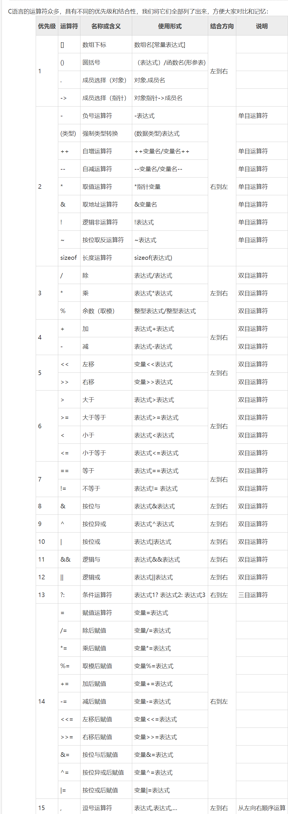

[toc]


# 数据库

### 1. 超键、主键、外键、候选键/码

`超键`：能够唯一标识一条记录的属性或属性集

`候选键`：能够唯一标识一条记录的**最小**属性集

`主键`：**某个**能够唯一标识一条记录的最小属性集

`外键`：如果一个关系模式中某个非主属性在另一个关系中是主属性，那么这个非主属性被称为是另一个关系的外键

### 2. 数据库设计的6个步骤

1. 需求分析：自顶向下

2. 概念结构设计：自底向上

3. 逻辑结构设计：E-R图

4. 物理结构设计

5. 数据库实施

6. 数据库的运行和维护

### 3. 数据库完整性概念、分类

1. 概念：完整性约束保证授权用户对数据库所做的修改不会破坏数据的一致性
2. 分类：**域**完整性（列的输入有效性）、**实体**完整性（主键的约束）、**参照**完整性（外键的约束）和用户定义的完整性约束
   1. **参照**完整性：参照关系中外码的值必须在被参照关系中实际存在或为null

### 4. SQL的四个组成部分

1. 数据定义语言（Data Definition Language）：CREATE、ALTER与DROP
2.  查询语言（Query Language）：SELECT
3.  数据操纵语言（Data Manipulation Language）：INSERT，UPDATE和DELETE
4.  数据控制语言（Data Control Language）。

### 5. 范式？1NF，2NF，3NF，BCNF？

1. **符合1NF的关系中的每个属性都不可再分**，**是所有关系型数据库的最基本要求**
   1. 缺点：
      1. 数据冗余（每个系的系主任名字重复出现）
      2. 更新异常（更换系主任，必须更新该系有关的每一个元组）
      3. 插入异常（新建了系，还没有招学生就无法插入老师信息）
      4. 删除异常（删除某个系所有学生记录，则系和系主任数据也随之消失）
2. **2NF在1NF的基础之上，消除了非主属性对于码的部分函数依赖**
3. **3NF在2NF的基础之上，消除了非主属性对于码的传递函数依赖**
4. **BCNF在3NF的基础上，消除主属性对于码的部分与传递函数依赖**

### 6. 什么是事务？事务的特点是什么？

事务：由查询和更新语句(数据库操作)的**序列**组成。SQL标准规定当一条SQL语句被执行，就隐式地开始了一个事务

特点：ACID

1. 一致性（Consistency）:对数据完整性约束【事务执行的结果必须是使数据库**从一个一致性状态变到另一个一致性状态**】
2. 原子性（Atomicity）事务中的操作**要么都做**，**要么都不做**
3. 隔离性（Isolation）:事务**互不干扰**
4. 持续性（Durability）：一旦被提交，**永久存储**

### 7. DB并发操作通常带来哪些问题？

[点击跳转答案答案答案](#3. 并行操作会引起哪些数据不一致？)

### 8. 数据库故障分类

1. 事务内部的故障
2. 系统故障
3. 介质故障
4. 计算机病毒

### 9. 数据库三级模式？

* 内模式【存储模式】只有一个  ：数据在存储介质上的存储方式和物理结构
* 外模式【用户模式】可以有多个  ：某个或某几个用户所看到的数据库的**数据视图**，是与某一应用有关的数据的逻辑表示
* 模式【逻辑模式】只有一个  ：对于数据的结构性描述

### 10. 什么是视图？表和视图的区别和联系？视图有什么优点？

* 视图：在概念上包含查询的结果，但并不预先计算并存储的“虚关系”
  * 优点：使用户能多角度看数据；数据保护；提供一定的逻辑独立性
* 区别：表可以建李主键，视图不可以
* 联系：视图的数据来源于表的某个部分

### 11. 数据字典包含五个部分？

* 数据项：数据长度、类型、名等等
* 数据结构：数据之间的组合关系
* 数据流：数据结构在系统内传输的路径
* 数据存储：数据结构保存的地方
* 处理过程

### 12. 数据库三要素？

* 静态特征（数据结构）
* 动态特征（数据操作）
* 完整性约束条件

### 13. 


# 操作系统

### 1. 内核级线程和用户级线程优缺点

**用户级**：不需要内核支持而在用户程序中实现的线程，它的内核的切换是由用户态程序自己控制内核的切换，**不需要内核的干涉**【OS内核不可感知】

* 优点：可以在不支持线程的OS中实现；不需内核参与实现简单
* 缺点：一个用户级线程阻塞会引起整个进程阻塞

**内核级**：切换由内核控制，当线程进行切换的时候，由用户态转化为内核态。切换完毕要从内核态返回用户态。【OS内核可感知】

* 优点：一个进程的多个线程可以并行执行
* 缺点：管态目态转换占用系统资源

### 2. 管态和目态？

**管态**：=核心态，能执行所有指令

**目态**：=用户态，只能执行非特权指令

<u>目态转换为管态的唯一途径是**中断**</u>

### 3. 并行操作会引起哪些数据不一致？

* **脏读**：就是指当一个事务对数据进行了修改但还没有提交到数据库时，另一个事务访问并使用了这个数据（**事务T1读取到了事务T2未提交的数据**） 
* **不可重复读**：事务T1读取某一数据后，事务T2对其做了修改，当事务T1再次读取数据时，得到与前一次不同的数据(**同样的条件，你读取过的数据，再次读取出来发现值不一样了**。)
* **丢失修改**：两个事务T1和T2读入同一数据并修改，T2提交的结果覆盖了T1提交的结果（**事务T1修改数据未提交，T2对同样数据修改提交，这样数据库没有出现T1修改的结果**）
* **（幻读）：**事务在插入已经检查过不存在的记录时，惊奇的发现这些数据已经存在了，之前的检测获取到的数据如同鬼影一般

### 4. 进程 程序 线程 任务的区别?

* 进程：一个具有独立功能的程序在某个数据集上的一次动态**执行过程**，是系统进行资源分配和调度的基本单元
* 程序：程序是指令和数据的有序集合
* 线程：轻量级进程，系统调度的基本单位
* 任务：由软件完成的一个活动

### 5. 什么是系统调用？

* 通俗讲，就是调用系统内核的服务
* 系统调用是OS与APP之间的接口，是用户取的OS服务的唯一途径
* 系统调用程序运行在用户态，被调用程序运行在系统态

### 6. 什么是死锁？死锁的4个必要条件？有哪些解决方案？

* 死锁是指两个或两个以上的进程在执行过程中,因争夺资源而造成的一种**互相等待**的现象,若无**外力**作用,它们都将无法推进下去
* 四个必要条件：
  * **互斥条件**：一个资源每次只能被一个进程使用。
  * **请求与保持条件**：一个进程因请求资源而阻塞时，对已获得的资源保持不放。
  * **不剥夺条件**:进程已获得的资源，在末使用完之前，不能强行剥夺。
  * **循环等待条件**:若干进程之间形成一种头尾相接的循环等待资源关系。
* 处理死锁：
  * 预防：
  * 避免：银行家算法
  * 检测与接触：

### 7. 同步互斥举例

* **互斥**：间接制约：多个进程同时请求打印机
* **同步**：直接制约：进程先后执行某个操作，如读写进程

### 8. 什么是管程

一个管程定义了一个DS和能为并发进程所执行的一组操作，这些操作能同步进程和改变管程中的数据

特点：

* 管程的进程只能访问管程的局部变量【相当于管程定义**私有变量**和**私有方法**来调用私有变量】
* 任何时候只能有**一个**进程进入管程

### 9. 为什么引入多道程序技术？

* 提高CPU利用率
* 提高内存和I/O设备利用率
* 增加系统吞吐量

### 10. 什么是缓冲技术？为什么需要缓冲技术？

* 缓冲技术主要解决设备速度差异引起的效率问题。是典型的以空间换时间的技术。
* 缓冲技术作用：
  * 缓解CPU与IO之间速度不匹配的问题
  * 提高CPU与IO之间并行性

### 11. 设备驱动是不是属于操作系统？

不属于。驱动程序是OS控制IO设备的软件，是与硬件之间通讯的桥梁

### 12. 进程挂起的作用/时机？

* 内存不足时，节约内存资源，为其他进程让出空间
* 用户请求
* 协调子进程之间的行为

### 13. 各种文件操作过程？

* 删除
	1. 找到文件目录项，并删除这一项
	2. 回收文件占用的存储空间
* 新建
  1. 先分配外存空间
  2. 再建立文件目录项
* 读文件
  1. 查找目录，找到文件目录项
  2. 读取外存位置

### 14. 链接分类？

* 静态链接：运行前，`.o文件`链接成完整的exe文件
* 装入时动态链接：一边装入内存一边link
* 运行时动态链接：运行时才进行link操作【节省内存、减少页面交换】

### 15. 装入分类？

* 绝对装入：物理地址 == 逻辑地址
* 可重定位装入：【静态重定位】一次性完成地址变换
* 动态运行时装入：【动态重定位】利用重定位寄存器，先装入内存，运行时再转换

### 16. unix文件存储方式？

混合索引存储：小文件用单级索引，大文件可以用多级索引存储

- `eg.`混合索引方式的索引结点中设有 13 个地址项
  - 直接地址：前 10 个地址项用来存放直接地址
  - 一次间接地址：第 11 个地址项来提供一次间接地址
  - 多次间接地址：第 12 个地址项来提供二次间接地址，第 13 个地址项来提供三次间接地址

# 计网

### 1.什么是CSMA/CD协议

全称：带**冲突检测**的**载波侦听多路访问**

- 冲突检测：采用特定算法检测是否发生冲突
- 载波侦听：设备在欲发送帧前，必须对介质进行侦听，当确认其**空闲**时，才可以**发送**
- 多路访问：一个设备发送的帧也可以**被多个设备接收**
- 适用于**总线型网络**
- **半双工通信**
- 争用期：2tao【只会在争用期发生冲突】

### 2. 简述以太网？以太网协议有哪些？

以太网：以太局域网，使用总线型拓扑和CSMA/CD技术

协议：

1. ARP协议：通过IP找MAC【通常用于某电脑找网关的mac】
2. RARP协议：通过MAC地址找IP

### 3. 曼彻斯特编码是什么？差分曼彻斯特编码又是什么？

* 曼彻斯特编码：每一位0/1中间有跳变【为解决其他编码为0时是结束传输还是传输0的问题】
* 差分：bit中间有跳变，bit和bit之间：有信号跳变则下一个bit为0，否则为1

### 4. OSI参考模型层次结构？及其每一层的作用？

1. **应用层**——所有能产生网络流量的程序
2. **表示层**——在传输之前是否进行加密 或 压缩 处理，二进制或ASCII码表示
3. **会话层**——查木马，看需求端和网站之间的连接
4. **传输层**——可靠传输，流量控制，不可靠传输(一个数据包即可，不需要建立会话，例如向DNS查询网站IP地址)
5. **网络层**——负责选择最佳路径，规划IP地址(ipv4和ipv6变化只会影响网络层)
6. **数据链路层**——帧的开始和结束，还有透明传输，差错校验(纠错由传输层解决)
7. **物理层**——定义网络设备接口标准，电气标准(电压)，如何在物理链路上传输的更快





### 5. TCP、UDP的比较？流量控制、拥塞控制的区别？怎样实现？

|       |   TCP    |      UDP       |
| :---: | :------: | :------------: |
|   1   | 面向连接 |     无连接     |
|   2   | 可靠交付 | 尽最大努力交付 |
| 3面向 |  字节流  |      报文      |

另外TCP的特点：可靠传输、流量控制、拥塞控制

* **流量控制**：控制发送端接收端的发送数据速率，以便能够**来得及处理**
  
* 滑动窗口协议
  
* **拥塞控制**：防止网络中路由器或者链路**过载**而导致数据传输性能下降

  * 慢开始、拥塞避免

  

  * 快重传【丢失后发三个重复确认立即重传】、快恢复

  

### 6. TCP传输三次握手是什么？四次挥手是什么？为什么要第三次握手？

* 三次握手：
  * -----SYN----->
  * <-----SYN-ACK---
  * -----ACK----->
* 第三次握手：对于服务端A，它需要知道客户端B能否收到自己的消息
* 四次挥手：
  * -----FIN----->
  * <-----ACK---
  * <-----FIN----
  * -----ACK----->

### 7. TCP面向连接，UDP面向无连接服务各有什么特点？

* 面向连接
  * 连接建立、数据传输和连接释放这三个阶段
  * 按序传送的，是可靠交付
* 面向无连接服务
  * 灵活方便和比较迅速
  * 尽量大努力支付
  * 不能防止报文丢失

### 8. 集线器？交换机？路由器？

* 集线器：物理层设备，无脑放大信号
* 交换机：数据链路层设备，使用物理地址MAC
* 路由器：网络层设备，使用逻辑地址IP

### 9. 什么是NAT技术？

NAT=Network Address Translation网络地址转换，属于接入广域网WAN技术

* 将IP数据报报头的IP地址转换为另一个IP（私有IP
* 解决了IP地址不够用的问题

### 10. IPV4和IPV6的区别？

1. IPv6具有**更大的地址空间**。IPv4中规定IP地址长度为32，最大地址个数为2^32 ；而IPv6中IP地址的长度为128，即最大地址个数为2^128。
2. IPv6具有**更高的安全性**。用户可以对网络层的数据进行加密并对IP报文进行校验
3. IPv6加入了对**自动配置**（Auto Configuration）的支持。这是对DHCP协议的改进和扩展，使得网络（尤其是局域网）的管理更加方便和快捷。

### 11. 什么是ARP协议？

* ARP是Address Resolution Protocol地址解析协议，通过目标设备的**IP地址**，查询到目标设备的**MAC地址**
* 他是网络层协议
* 举例：局域网计算机找网关问who has 192.168.1.1 然后将网关MAC地址返回给计算机，计算机就可以通讯了

### 12. DHCP协议？

* **D**ynamic **H**ost **C**onfiguration **P**rotocol**动态主机设置协议**
* 是应用层协议
* 用于局域网的IP地址分配

### 13. TCP、HTTP的区别？什么是套接字socket？

* TCP是传输层协议，通过三次握手建立可靠连接
* HTTP是应用层协议，负责数据传输
* HTTP数据是利用TCP进行传输的，支持HTTP就一定支持TCP
* 套接字是通信的基石，是支持TCP/IP协议的**网络通信基本单元**。
  * 套接字包含：连接使用的**协议**，本地主机的**IP地址**，本地进程的协议**端口**，远地主机的**IP地址**，远地进程的协议**端口**
  * 简单来讲，套接字 = IP地址+端口

### 14. 输入网址请求网页过程？

1. 浏览器本身是一个客户端，输入URL后浏览器会请求**DNS**服务器将域名转换为对应的IP
2. 通过IP地址找到对应服务器，请求**建立TCP连接**----三次握手
3. 通过三次握手确认后，开始**传输数据**
4. 浏览器**读取数据**渲染为网页
5. 数据传输结束后，四次挥手，**断开连接**


# C语言（题源课本）

### 1. c语言基本语法单位/单词符号p34

标识符、关键字、运算符、常量、分隔符

### 2. 读程题

1. p87

\* / %是同一级，运算从左往右

```c
int x = -30*5%-8;
printf("x=%d\n",x);		//输出-6
```

2. p89

优先级&>^>|

```c
int x = 013;	//8进制
x = 0b11;		//2
x = 0x13;		//16
//2.14
int x = 013;	//01011
int y = 025;	//11001
int z = 01;		//00001
printf("%x", x|y&z); 	//先&再|
```

3. p90   2.18

逗号表达式优先级最低，所以要让逗号前的所有运算完再进行下一个逗号，逗号表达式的值就是最后一个逗号表达式的值

```c
int sum = 10, cap = 10;
cap = sum++,cap++,++cap;		//cap = 10,cap++,++cap
printf("%d\n",cap);				//12
```


### 3. C语言优先级



### 4. 格式化输出

```c
printf("%10.3s\n","student");	//代表输出前三位，总占位10位，右对齐
printf("%-10.3s\n","student");	//代表输出前三位，总占位10位，左对齐

```

### 5. scanf和gets的区别p150

* scanf以空格为分割，gets读取字符串以回车分割
* printf以`'\0'`为结尾，puts以`'\n'`为结尾

### 6. 字符指针操作细节p203

```c
char *p = "chengdu";
printf("%s\n", p);		//输出指针变量指的整个字符串
printf("%x\n", p);		//输出指针变量指的字符地址【字符串首地址】
printf("%s\n", *p);		//输出指针变量指的那个字符
```

### 7. 原码补码

* 8位范围-128~127
* **正数**原码 == 反码 == 补码
* **负数原码**最高位1
* **负数反码**符号位不变，其余各位按位取反
* **负数补码** == 负数反码+1
* 负数以**补码**形式存储在磁盘

### 8. 4种隐式类型转换？p历年考

1. `算术运算式`中，**低类型**能够转换为**高类型**
2. `赋值表达式`中，**右值**类型自动隐式转换为**左值**类型，并赋值给它 
3. 函数调用中`参数传递`时，系统隐式地将**实参**转换为**形参**的类型后，赋给形参 
4. 函数有`返回值`时，系统将隐式地将**返回表达式类型**转换为**返回值类型**，赋给调用函数

### 9. 提高C语言执行效率？p历年考

1. 嵌入**汇编**语言，更贴近极限
2. API，可以**调用系统 API**，接近底层
3. 使用**寄存器变量**，提高存取速度。 
4. **位操作**:位操作可以减少除法和取模的运算
5. 使用**条件编译**，可减少被编译的语句，从而减少目标程序的长度，减少运行时间，当条件编译段比较多时， 目标程序长度可大大减少，这样可以提升程序执行效率(谭浩强原话)。

### 10. 字符指针和字符数组的细节区别？p204

```c
//字符数组
char s[] = "asdf";	//字符数组只能在定义时初始化赋值或用strcpy
s = "a";			//ERROR
strcpy(s, "aa");	//s = {'a','a','\0','f'}
s[0] = 'b';			//s = ba

//字符指针
char *s = "asdf";	//
s = "qwer";			//
strcpy(s, "aa");	//ERROR
s[0] = 'a';			//ERROR
```

### 11. 结构体和联合体的区别？

* 联合体union是**构造数据类型**，用几个不同类型的变量**共占**一段内存，所占内存长度是各**最长**成员占的内存长度。 【一个变量被赋值时，其余变量被赋予同样的二进制，只是二进制位数不同】
* 结构体struct是**构造数据类型**，把不同类型的数据**组合**成一个整体，所占内存长度是各成员占的内存长度的**总和**。 

### 12. 什么是数据类型？存储类型？

* 存储类型是数据在内存中的存储方式，有四种:auto，static，extern，register
  * auto和 register 用于声明**内部变量**；
    * auto 变量存储在**栈**中；(内部变量默认是 auto 类型)
    * register 变量存储在**寄存器**中;
  * extern 和 static 变量是存储在**静态存储区**中；
    * extern 用于声明外部变量；(外部变量默认是 extern 类型)
    * static 用于声明内部和外部变量；
* 数据类型
  * 整型
  * 字符型
  * 浮点型
  * 构造类型：数组、结构类型、联合类型、枚举类型
  * 指针类型
  * 空类型

